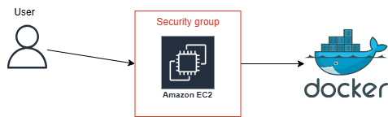
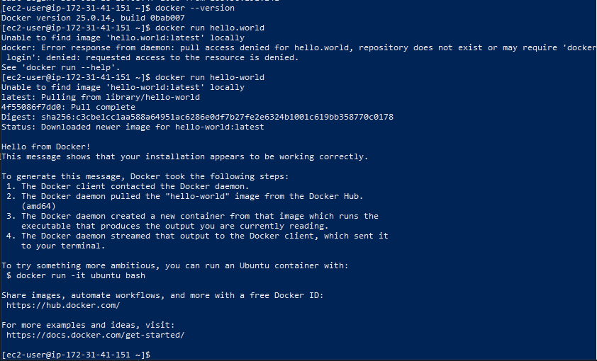
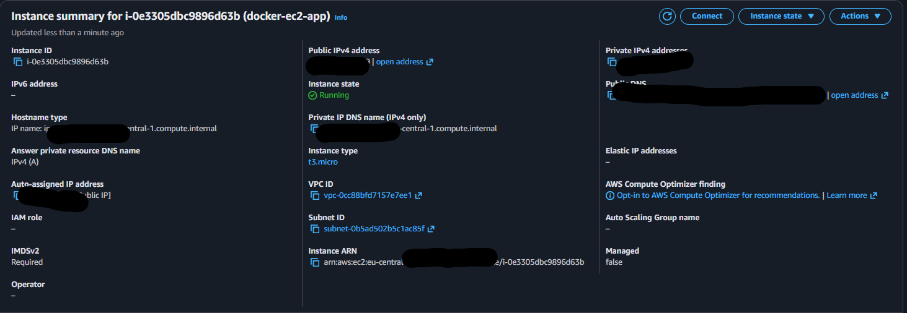
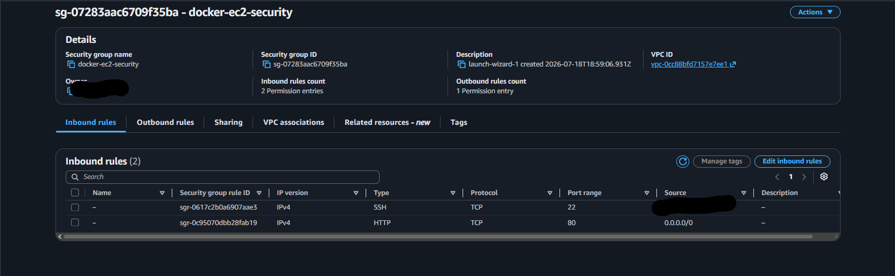
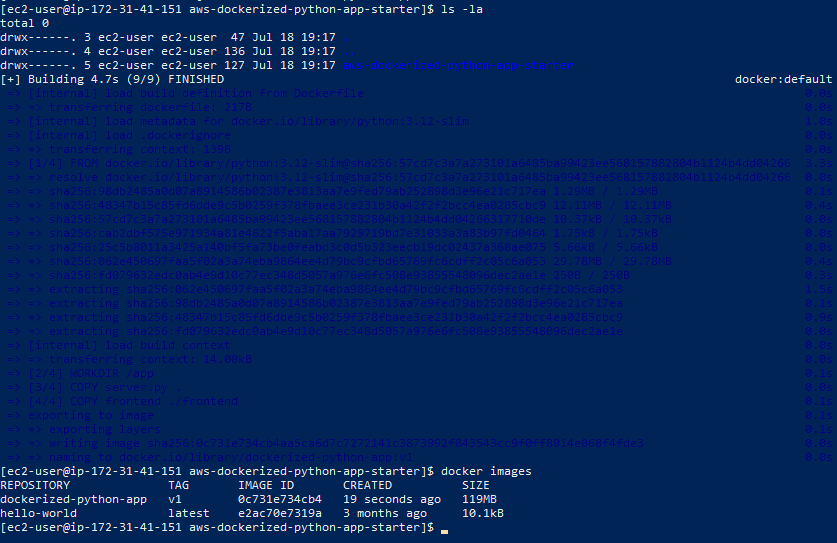
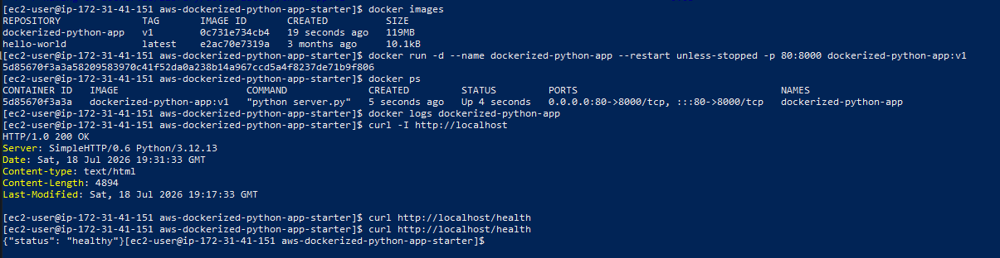
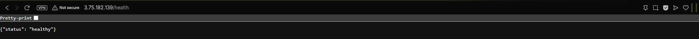
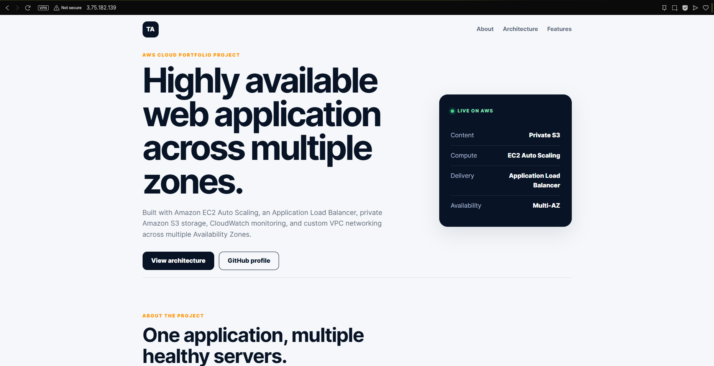

# Dockerized Python Web Application on AWS EC2

## Project Overview

This project demonstrates how a simple Python web application can be packaged into a Docker image and deployed as a container on Amazon EC2.

The application uses Python’s built-in HTTP server to deliver HTML, CSS, and JavaScript files. Docker packages the Python server and frontend into a image, while an EC2 instance provides the cloud environment.

This project focuses on understanding the complete container workflow: creating an image, starting a container, publishing container ports, testing application health, and deploying the result on AWS.

I deleted AWS environment after successful testing and documentation to avoid unnecessary costs.

## Project Background

The frontend used in this repository is reused from my previous Highly Available Web Application project.

Rather than spending time designing another website from the beginning, I reused the same HTML, CSS, and JavaScript files and focused on learning a different deployment method. In the previous project, the frontend was stored in Amazon S3 and delivered through EC2 Auto Scaling and an Application Load Balancer. In this project, those same frontend files are copied directly into a Docker image and served from a container running on a single EC2 instance.

Because the frontend was reused without changing its content, the website itself still describes the previous highly available architecture. This repository specifically demonstrates the Docker containerization and EC2 deployment process, not a new highly available environment.

## Architecture

The runtime request flow is:

1. A user sends an HTTP request to the EC2 public address.
2. The EC2 security group permits HTTP traffic on port 80.
3. Docker maps EC2 port 80 to port 8000 inside the container.
4. The Python server receives the request.
5. The server returns the existing HTML, CSS, and JavaScript frontend.
6. A separate `/health` endpoint returns a JSON response confirming that the Python application is running.

Administrator access used SSH on port 22 and was restricted to my own IP address.

## Technologies Used

- Amazon EC2
- Amazon Linux 2023
- Docker Engine
- Python 3.12
- Python standard library
- HTML5
- CSS3
- JavaScript
- SSH

## Application Design

### Python server

The application uses a small `server.py` file based on Python’s standard library. It starts a HTTP server on port 8000 and serves the files stored in the `frontend` directory.

No Flask, Gunicorn, database, or external Python packages were required. This kept the Python application simple and allowed the project to remain focused on Docker and AWS deployment.

The Python server also provides a `/health` endpoint that returns a healthy JSON response. This provides a straightforward way to confirm that the container and application are working.

### Docker image

The Docker image uses the lightweight Python 3.12 slim image as its base.

During the image build, Docker:

1. Creates an application working directory.
2. Copies the Python server into the image.
3. Copies the existing frontend into the image.
4. exposes container port 8000.
5. configures the Python server as the container’s startup process.

The resulting image is self-contained and does not require Amazon S3 or external Python dependencies while running.

### EC2 deployment

A `t3.micro` Amazon Linux 2023 EC2 instance was used as the Docker host.

Docker Engine was installed directly on the instance. The project files were transferred from Windows to EC2 using SCP, and the Docker image was built on the EC2 instance.

The container ran in detached mode with an automatic restart policy. Host port 80 was mapped to container port 8000, allowing visitors to access the application without specifying a custom port.

## Security

The EC2 security group used two inbound rules:

- HTTP on port 80 from the internet, allowing visitors to open the application.
- SSH on port 22 restricted to my current public IP address.

The EC2 private key was stored locally and was not added to this repository. AWS account information and personal IP addresses were deleted from the project screenshots for personal security.

This was a demonstration environment using HTTP. 

## Deployment Process

The project was completed through the following stages:

1. Reused the frontend from the previous Highly Available Web Application project.
2. Created a small Python server for the static files and health endpoint.
3. Created a Dockerfile describing the application image.
4. Launched an Amazon Linux 2023 EC2 instance.
5. Configured HTTP and restricted SSH access through a security group.
6. Installed and verified Docker Engine on EC2.
7. Transferred the application files to the instance using SCP.
8. Built the Docker image from the Dockerfile.
9. Started the container with port 80 mapped to container port 8000.
10. Tested the homepage and Python health endpoint locally and publicly.
11. Captured deployment evidence and created an architecture diagram.
12. Terminated the AWS resources after validation.

## Deployment Evidence

### Docker installation on EC2

Docker was installed on Amazon Linux 2023 and verified using Docker’s test container.

### EC2 instance

The application was hosted on a running `t3.micro` Amazon Linux EC2 instance.

### EC2 security group

The security group allowed public HTTP traffic while restricting SSH access to my IP address.

### Docker image build

The Python base image, server and existing frontend files were packaged into a custom Docker image.

### Running Docker container

The container ran in the background with EC2 port 80 mapped to container port 8000. The terminal tests confirmed that both the homepage and health endpoint responded successfully.

### Public Python health endpoint

The `/health` endpoint returned a successful JSON response from the Python application.

### Application accessed through Docker

The reused frontend was successfully served from the Docker container through the EC2 public address.

## Repository Structure

- `docs/Architecture.png` — deployment architecture diagram
- `frontend/index.html` — reused website homepage
- `frontend/404.html` — custom error page
- `frontend/health.html` — static health-check file from the previous project
- `frontend/styles.css` — website styling
- `frontend/script.js` — frontend JavaScript
- `screenshots/` — AWS and Docker deployment evidence
- `server.py` — simple Python web server and JSON health endpoint
- `Dockerfile` — Docker image definition
- `.dockerignore` — files excluded from the Docker build context
- `.gitignore` — files excluded from Git tracking

## What I Learned

This project provided practical experience with:

- Understanding the difference between Docker images and containers
- Writing and interpreting a Dockerfile
- Building a custom Docker image
- Publishing container ports
- Running and inspecting containers
- Viewing container logs
- Installing Docker on Amazon Linux
- Connecting to EC2 through SSH
- Transferring files with SCP
- Configuring EC2 security-group rules
- Implementing a basic Python health endpoint
- Reusing an existing application with a different deployment architecture
- Cleaning up cloud resources after project completion

## Possible Improvements

Future improvements could include:

- Storing the image in Amazon Elastic Container Registry
- Automatically building and deploying images with CI/CD
- Adding an Application Load Balancer
- Running containers across multiple Availability Zones
- Adding HTTPS with a domain and TLS certificate
- Using a production Python application server
- Sending application and container logs to Amazon CloudWatch
- Migrating the deployment to Amazon ECS

## Project Status

The Docker image, running container, public website and Python health endpoint were successfully tested on Amazon EC2.

The EC2 instance and related resources were removed after the project was documented.
